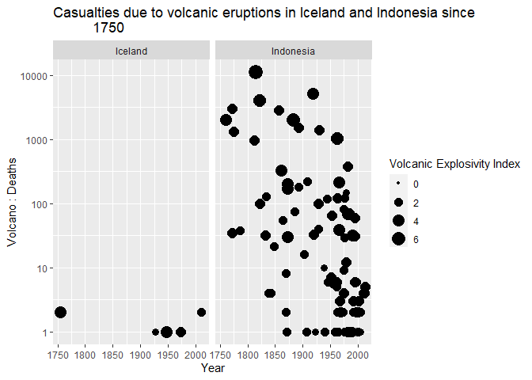

Homework 1
================
August Jonasson
2022-11-10

### Brief description of my past experiences

The only past experiences I have with R, R Studio and R Markdown are
those which I attained in the “Sannolikhetsteori 1” course, which are
next to none, since we were handed all of the code needed to complete
the assignments. Our main focus was to examine and draw conclusions from
the results that followed.

As a result, my past experiences with dplyr and ggplot2 are
non-existent.

Git and Github, on the other hand, I have some experience with. I was
introduced to git in the “Datalogi för matematiker” course, where we
were required to use a github repo for our final course-projects. I am
therefor familiar with using the basic operations from the terminal,
such as add, commit, push, pull and clone.

I also used github, although not very extensively, during my summer
internship. This mainly helped me cement what I had already learnt
during the computer science course.

### Assignment

I think volcanoes are pretty cool, so I found **The Significant Volcanic
Eruption Database** (top Google result), which is a global listing of
over 500 significant volcanic eruptions, dating all the way back to year
-4360. To see what classifies as “significant”, and more, here is the
[Source](https://public.opendatasoft.com/explore/dataset/significant-volcanic-eruption-database/information/)
of the data.

We start with loading the data into a tibble data frame

``` r
# since the acquired csv file was semi-colon separated, we use read_csv2
eruptions <- read_csv2("significant-volcanic-eruption-database.csv")
```

Now, lets come up with something to examine. We know that our close
neighbors, Iceland, have a lot of volcanic activity. We also know that
Indonesia is pretty famous for their volcanoes. Lets filter them out to
try and see if anything stands out.

``` r
# creating a data frame only containing eruptions from Iceland and Indonesia
# also sort out all observations that have missing Volcanic Explosivity Indices
iceland_indonesia <- eruptions %>%
  filter(Country %in% c("Iceland", "Indonesia")) %>%
  filter(is.na(`Volcanic Explosivity Index`) == FALSE)
```

Upon examining the data, we notice that the casualties count for each
eruption has a lot of missing values before the year 1750. Therefor, we
decide to filter them out too, as well as the missing values.

``` r
iceland_indonesia_1750_ <- iceland_indonesia %>%
  filter(Year > 1750, is.na(`Volcano : Deaths`) == FALSE) 
```

Now, lets plot something

``` r
# scatter plot of casualties due to volcanic eruptions
ggplot(iceland_indonesia_1750_, aes(x=Year, y=`Volcano : Deaths`,
                                    size=`Volcanic Explosivity Index`)) +
  geom_point() + 
  scale_y_log10() + 
  facet_wrap(~ Country) + 
  ggtitle("Casualties due to volcanic eruptions in Iceland and Indonesia since
          1750")
```

<!-- -->

The Indonesian volcanoes have certainly had more devastating effects on
humanity than the Icelandic ones, during the last 300-ish years.
However, upon further inspection of the data, we realize that these
deaths are actually not a direct cause of the actual explosion. Most
deaths occur because of the ash that falls over very large areas (for
sometimes years after the actual eruption), causing buildings to
collapse. Mud-flows are apparently a huge contributing factor as well.
The resulting casualties are sometimes not even mainly from the country
in which the eruption took place.

Because of this realization, that the data is very complex, we decide to
stop here. Maybe this could be something for the project.

    ## R version 4.2.1 (2022-06-23 ucrt)
    ## Platform: x86_64-w64-mingw32/x64 (64-bit)
    ## Running under: Windows 10 x64 (build 19045)
    ## 
    ## Matrix products: default
    ## 
    ## locale:
    ## [1] LC_COLLATE=Swedish_Sweden.utf8  LC_CTYPE=Swedish_Sweden.utf8   
    ## [3] LC_MONETARY=Swedish_Sweden.utf8 LC_NUMERIC=C                   
    ## [5] LC_TIME=Swedish_Sweden.utf8    
    ## 
    ## attached base packages:
    ## [1] stats     graphics  grDevices utils     datasets  methods   base     
    ## 
    ## other attached packages:
    ## [1] forcats_0.5.2   stringr_1.4.1   dplyr_1.0.10    purrr_0.3.5    
    ## [5] readr_2.1.3     tidyr_1.2.1     tibble_3.1.8    ggplot2_3.4.0  
    ## [9] tidyverse_1.3.2
    ## 
    ## loaded via a namespace (and not attached):
    ##  [1] lubridate_1.9.0     assertthat_0.2.1    digest_0.6.29      
    ##  [4] utf8_1.2.2          R6_2.5.1            cellranger_1.1.0   
    ##  [7] backports_1.4.1     reprex_2.0.2        evaluate_0.16      
    ## [10] highr_0.9           httr_1.4.4          pillar_1.8.1       
    ## [13] rlang_1.0.6         googlesheets4_1.0.1 readxl_1.4.1       
    ## [16] rstudioapi_0.14     rmarkdown_2.16      labeling_0.4.2     
    ## [19] googledrive_2.0.0   bit_4.0.4           munsell_0.5.0      
    ## [22] broom_1.0.1         compiler_4.2.1      modelr_0.1.9       
    ## [25] xfun_0.32           pkgconfig_2.0.3     htmltools_0.5.3    
    ## [28] tidyselect_1.2.0    fansi_1.0.3         crayon_1.5.2       
    ## [31] tzdb_0.3.0          dbplyr_2.2.1        withr_2.5.0        
    ## [34] grid_4.2.1          jsonlite_1.8.0      gtable_0.3.1       
    ## [37] lifecycle_1.0.3     DBI_1.1.3           magrittr_2.0.3     
    ## [40] scales_1.2.1        cli_3.4.1           stringi_1.7.8      
    ## [43] vroom_1.6.0         farver_2.1.1        fs_1.5.2           
    ## [46] xml2_1.3.3          ellipsis_0.3.2      generics_0.1.3     
    ## [49] vctrs_0.5.0         tools_4.2.1         bit64_4.0.5        
    ## [52] glue_1.6.2          hms_1.1.2           parallel_4.2.1     
    ## [55] fastmap_1.1.0       yaml_2.3.5          timechange_0.1.1   
    ## [58] colorspace_2.0-3    gargle_1.2.1        rvest_1.0.3        
    ## [61] knitr_1.40          haven_2.5.1
