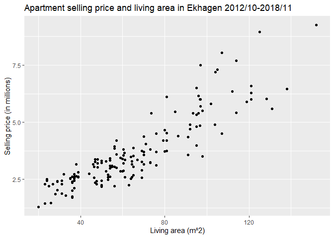
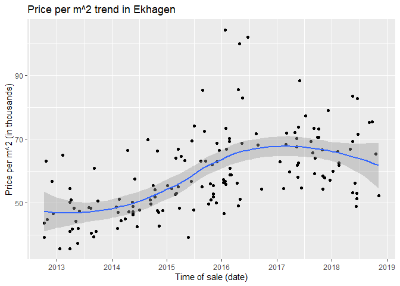
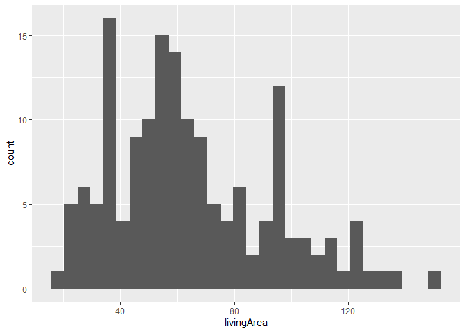
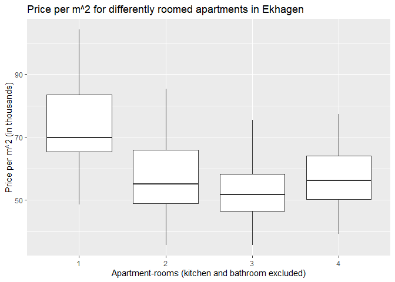
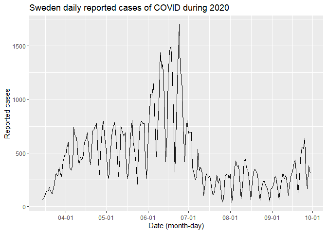
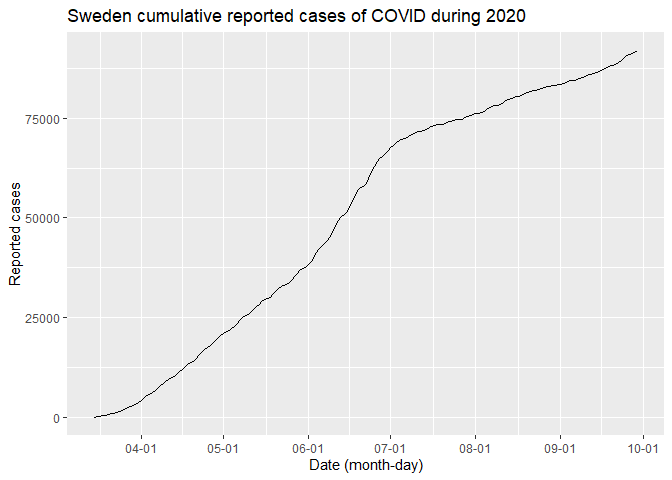
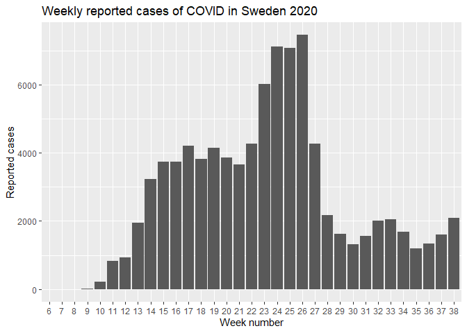

Homework 2
================
August Jonasson
2022-11-18

## Exercise 1: Apartment prices

We start by loading the data into a tibble.

``` r
# creating a dataframe containing the apartment prices
apartments <- read_csv("../hw_data/Booli_sold.csv")
```

#### Task a

Illustrating how the selling price is dependent on the living area using
a scatter-plot.

``` r
# scatter-plot of selling price (in millions) and living area
apartments %>%
  ggplot(aes(x=livingArea, y=soldPrice/1000000)) +
  geom_point() +
  xlab("Living area (m^2)") +
  ylab("Selling price (in millions)") +
  ggtitle("Apartment selling price and living area in Ekhagen 2012/10-2018/11")
```

<!-- -->

#### Task b

Now, lets examine the price per square meter. We use a scatter-plot
combined with a regression line to illustrate the trend over time.

``` r
# creating new variable ppm2 (price per m^2 (in thousands)) and then creating a 
# scatter plot overlaid with a regression line, to illustrate the trend
apartments %>%
  mutate(ppm2 = soldPrice / livingArea / 1000) %>%
  ggplot(aes(x=soldDate, y=ppm2)) +
  geom_point() +
  geom_smooth(method = "loess") +
  scale_x_date(date_breaks = "1 year", labels = date_format(format = "%Y")) +
  xlab("Time of sale (date)") +
  ylab("Price per m^2 (in thousands)") +
  ggtitle("Price per m^2 trend in Ekhagen")
```

<!-- -->

#### Task c

Let’s make a table of number of rooms in relation to construction year,
of the apartments from our data. The column headers are the number of
rooms, and the rows represent the construction year.

``` r
# using kable to make the table slightly prettier
table <- table(apartments$constructionYear, apartments$rooms)
kable(table, caption = "Table 1", "simple")
```

|      |   1 | 1.5 |   2 | 2.5 |   3 | 3.5 |   4 | 4.5 |   5 |   6 |
|------|----:|----:|----:|----:|----:|----:|----:|----:|----:|----:|
| 1931 |   0 |   0 |   0 |   0 |   0 |   0 |   2 |   0 |   0 |   0 |
| 1934 |   0 |   2 |   0 |   0 |   0 |   0 |   0 |   0 |   0 |   0 |
| 1935 |   8 |   3 |  38 |   4 |  13 |   3 |   9 |   1 |   0 |   1 |
| 1936 |   4 |   0 |   3 |   0 |   3 |   0 |   6 |   0 |   1 |   0 |
| 1937 |   1 |   0 |   2 |   1 |   0 |   0 |   0 |   0 |   1 |   0 |
| 1939 |   2 |   0 |   4 |   0 |   2 |   0 |   0 |   0 |   0 |   0 |
| 1968 |   5 |   0 |   8 |   0 |   2 |   1 |   2 |   0 |   0 |   1 |
| 1969 |   0 |   1 |   4 |   0 |   2 |   1 |   2 |   0 |   1 |   0 |

Table 1

#### Task d

It would be interesting to see if the living area of the sold apartments
indicate some type of distribution.

``` r
# plotting a histogram of living area, of the sold apartments
apartments %>%
  ggplot(aes(x=livingArea)) +
  geom_histogram()
```

<!-- -->

Pretty hard to tell. Maybe because family sizes differ. Unfortunately,
we don’t have that data.

#### Task e

Lets plot the price per square meter (in thousands) for 1, 2, 3, and
4-room apartments using box plot.

``` r
# creating box plots for differently roomed apartments and the their m^2-price
apartments %>%
  filter(rooms %in% c(1,2,3,4)) %>%
  mutate(ppm2 = soldPrice / livingArea / 1000) %>%
  ggplot(aes(x = as.factor(rooms), y=ppm2)) +
  geom_boxplot() +
  xlab("Apartment-rooms (kitchen and bathroom excluded)") +
  ylab("Price per m^2 (in thousands)") +
  ggtitle("Price per m^2 for differently roomed apartments in Ekhagen")
```

<!-- -->

## Exercise 2: Folkhälsomyndigheten COVID cases, and excel

### Data wrangling tasks

#### Task a

The file consists of daily confirmed cases, resulting casualties, and
patients in need of intensive care, due to COVID, in Sweden. This
information is enriched by factors such as province, municipality and
patient age and sex. All of the sheets are different manipulations of
this data.

    Sheet 1: "Antal per dag region" - confirmed cases by province, per day
    Sheet 2: "Antal avlidna per dag" - deceased patients per day
    Sheet 3: "Antal intensivvårdade per dag" - ICU-patients per day
    Sheet 4: "Totalt antal per region" - total count of Sheet 1, 2 and 3, by province
    Sheet 5: "Totalt antal per kön" - total count of Sheet 1, 2 and 3, by sex
    Sheet 6: "Totalt antal per åldersgrupp" - total count of Sheet 1, 2 and 3, by age
    Sheet 7: "Veckodata region" - weekly data with a cumulative aspect, by province
    Sheet 8: "Veckodata Kommun_stadsdel" - weekly data with a cumulative aspect, by municipality
    Sheet 9: "FOHM 30 Sep 2020" - Information about how often the data is updated

#### Task b

Lets read all of the sheets in as separate tibbles. Sheet 9 is ignored
since it doesn’t contain anything useful.

``` r
# excel file path
file <- "../hw_data/Folkhalsomyndigheten_Covid19.xlsx"

# Sheet 1 = s1, Sheet 2 = s2...
s1 <- read_excel(file, sheet = 1) # Antal per dag region
s2 <- read_excel(file, sheet = 2) # Antal avlidna per dag
s3 <- read_excel(file, sheet = 3) # Antal intensivvårdade per dag
s4 <- read_excel(file, sheet = 4) # Totalt antal per region
s5 <- read_excel(file, sheet = 5) # Totalt antal per kön
s6 <- read_excel(file, sheet = 6) # Totalt antal per åldersgrupp
s7 <- read_excel(file, sheet = 7) # Veckodata region
s8 <- read_excel(file, sheet = 8) # Veckodata Kommun_stadsdel
```

#### Task c

Printing the requested table containing the first and last five rows of
the s2- tibble.

``` r
# using kable to print the table
s2_head <- head(s2, 5)
s2_tail <- tail(s2, 5)
kable(rbind(s2_head, s2_tail), caption = "Table 2", "simple")
```

| Datum_avliden  | Antal_avlidna |
|:---------------|--------------:|
| 43901          |             1 |
| 43902          |             0 |
| 43903          |             1 |
| 43904          |             1 |
| 43905          |             2 |
| 44100          |             2 |
| 44101          |             0 |
| 44102          |             0 |
| 44103          |             0 |
| Uppgift saknas |             5 |

Table 2

From Table 2, we can see that the last entry seems a bit suspicious.
“Uppgift saknas” is Swedish for “NA”. Upon further investigation we can
tell that the variable “Datum_avliden” is actually parsed as chr - a
string, but this is supposed to be a date. We redefine the read function
for this tibble to not include the last row, and then check the class of
the variable again.

``` r
s2 <- read_excel(file, sheet = 2, n_max = 203)
class(s2$Datum_avliden)
```

    ## [1] "POSIXct" "POSIXt"

Now it’s parsed as a date and we are good.

#### Task d

``` r
class(s8$Stadsdel)
```

    ## [1] "logical"

As we can tell from this result, the ‘Stadsdel’ variable from Sheet 8
has the type ‘logical’. Using the ‘unique’ function we can also tell
that ‘NA’ is the only value that appears under this variable, but a
quick check in the original excel file reveals that this shouldn’t be
the case. The first 1882 rows should have the value ‘NA’, but then some
strings should appear.

Reading up on the read_excel documentation we find out that the reason
this happens is because the guess_max argument, by default, is set to
1000, ergo the read_excel function makes up its mind about the data type
based on the first 1000 rows. Since our first 1000 rows were ‘NA’ (read
as FALSE?), it decided that the data type should be ‘logical’. This can
easily be fixed by increasing the guess_max value.

``` r
s8 <- read_excel(file, sheet = 8, guess_max = 1883)
class(s8$Stadsdel)
```

    ## [1] "character"

Now it’s parsed as a string and we are good.

#### Task e

Checking the values for the ‘tot_antal_fall’ and ‘nya_fall_vecka’
variables in Sheet 8.

``` r
class(s8$tot_antal_fall)
```

    ## [1] "character"

``` r
class(s8$nya_fall_vecka)
```

    ## [1] "character"

They are both parsed as strings, but from the excel file it looks like
they should be numerical.

From looking further at the excel file we see that there are several
values in both columns typed in as ‘\<15’, instead of the precise value
of that day. Some of the ‘\<15’ values we can actually deduce to being a
precise number, based on the days that follow, but for most of them,
they are as good as ‘NA’ - missing values. Since we are not paid to do
this we take the very crude approach and replace all of them with ‘NA’.
This can easily be done using the as.numeric function, since this
automatically assigns ‘NA’ to all values that can’t be parsed as
numbers.

``` r
# creating a modified version of s8, replacing all '<15' with 'NA'
s8_mod <- s8 %>%
  mutate(tot_antal_fall = as.numeric(tot_antal_fall),
         nya_fall_vecka = as.numeric(nya_fall_vecka))

class(s8_mod$tot_antal_fall)
```

    ## [1] "numeric"

``` r
class(s8_mod$nya_fall_vecka)
```

    ## [1] "numeric"

Now they both have the numeric type, and we are good.

### Statistics and plotting

#### Task a

We want to create a new data frame containing the total number of
confirmed cases in each region, and country-wise.

``` r
# the new data frame is created using summarize and across, with the sum fctn.
total_by_province <- s1 %>%
  summarize(across(2:last_col(), ~ sum(.)))
```

Now, to extract the total number of cases and the provinces with the
most and least cases respectively.

``` r
# we first transpose the data frame since it's kinda annoying to use horizontally
totprov_trans <- data.frame(t(total_by_province)) %>%
  rename(antal_fall = t.total_by_province.) %>%
  arrange(desc(antal_fall))

# display total, max and min using kable
kable(rbind(head(totprov_trans, 2), tail(totprov_trans, 1)),
      caption = "Table 3: Total cases, max and min by provinces",
      "simple")
```

|                   | antal_fall |
|-------------------|-----------:|
| Totalt_antal_fall |      92863 |
| Stockholm         |      25146 |
| Gotland           |        330 |

Table 3: Total cases, max and min by provinces

As we can see from Table 3, the total number of cases was 92863, the
province with the most cases was Stockholm, and the province with the
least cases was Gotland.

While the provincial counts on their own are interesting, comparing them
to each other might be a bit misleading. Partly because the population
sizes differ greatly. Additionally, the population densities probably
has some effect as well , since we are talking about the spread of a
decease that’s transmitted through peoples breath. If one were to
compare provinces, these factors (and probably many more) should be
considered.

#### Task b

Plotting the daily number of reported cases nationwide in Sweden.

``` r
s1 %>%
  filter(Statistikdatum > as.POSIXct("2020-03-15")) %>%
  ggplot(aes(x=Statistikdatum, y=Totalt_antal_fall)) +
  geom_line() +
  scale_x_datetime(date_breaks = "1 month", labels = date_format("%m-%d")) +
  xlab("Date (month-day)") +
  ylab("Reported cases") +
  ggtitle("Sweden daily reported cases of COVID during 2020")
```

<!-- -->

And for the cumulative value of the reported cases.

``` r
s1 %>%
  filter(Statistikdatum > as.POSIXct("2020-03-15")) %>%
  mutate(kumulativt_antal = cumsum(Totalt_antal_fall)) %>%
  ggplot(aes(x=Statistikdatum, y=kumulativt_antal)) +
  geom_line() +
  scale_x_datetime(date_breaks = "1 month", labels = date_format("%m-%d")) +
  xlab("Date (month-day)") +
  ylab("Reported cases") +
  ggtitle("Sweden cumulative reported cases of COVID during 2020")
```

<!-- -->

#### Task c

Deriving the total number of weekly reported cases in Sweden and
plotting as a bar plot.

``` r
s7 %>%
  group_by(veckonummer) %>%
  summarize(tot_antal_fall_vecka = sum(Antal_fall_vecka)) %>%
  ggplot(aes(x=as.factor(veckonummer), y=tot_antal_fall_vecka)) +
  geom_col() +
  xlab("Week number") +
  ylab("Reported cases") +
  ggtitle("Weekly reported cases of COVID in Sweden 2020")
```

<!-- -->
