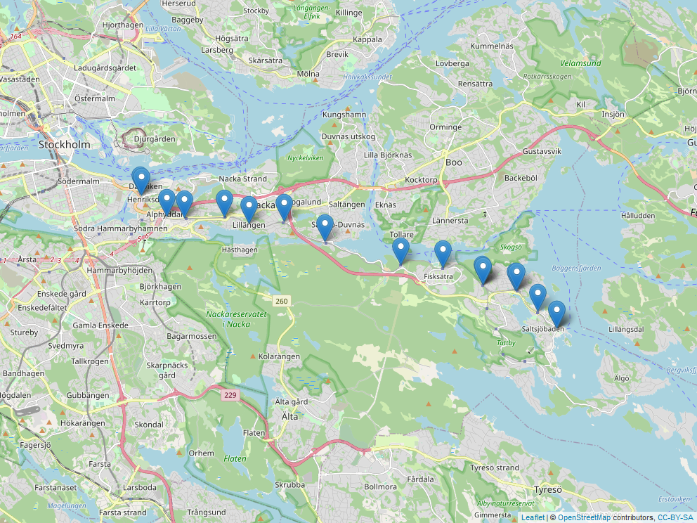

```{r, include=FALSE}
library(RSQLite)
library(tidyverse)
library(lubridate)
```

## Exercise 1: Marketing, conversions and conversion lags


```{r}
# Connecting to SQLite db and then saving the two tables as data frames
con <- dbConnect(RSQLite::SQLite(), "../hw_data/seo_marketing_data.sqlite")
df_clicks <- tibble(dbReadTable(con, "Clicks"))
df_conversions <- tibble(dbReadTable(con, "Conversion_value"))
```

#### task a

Visualizing the number of clicks per day for mid 2020. Replacing NA-values
with zero.
```{r}
# daily summaries of ad clicks
df_clicks_daily <- df_clicks %>%
  mutate(date = as.POSIXct(date)) %>%
  replace_na(list(adgroup = 0L)) %>%
  group_by(date) %>%
  summarize(clicks = n())

# plotting daily ad clicks as line diagram
df_clicks_daily %>%
  ggplot(aes(date, clicks)) +
  geom_line() +
  scale_x_datetime(date_breaks = "1 week", date_labels = "%W") +
  xlab("Week") +
  ylab("Clicks") +
  ggtitle("Daily ad-clicks during the weeks of 2020")
```

#### task b

Given that there is a cost to each click, we want to find out which day of the
week has been the most costly.
```{r}
# creating an ordered table of most costly weekdays, using lubridate::wday
df_clicks_daily %>%
  mutate(weekday = wday(date, label = TRUE, abbr = FALSE)) %>%
  group_by(weekday) %>%
  summarize(clicks = sum(clicks)) %>%
  arrange(desc(clicks)) %>%
  knitr::kable(caption = "Table 1: Weekday clicks", "simple")
```

From Table 1 we can tell that, assuming there is a cost to each click, Monday
is the most costly day of the week, with Sunday as a close second.

#### task c

Plotting  a histogram of the conversion values.
```{r}
# df_conversions value as histogram
df_conversions %>%
  mutate(date = as.POSIXct(date)) %>%
  ggplot(aes(value)) +
  geom_histogram(bins = 70) +
  xlab("Conversion value") +
  ylab("Count") +
  ggtitle("Histogram of conversion values")
```

#### task d

Joining the two data frames in order to calculate the conversion lags (CL).
Since we are only interested in the actual conversions, we can ignore the clicks
that didn't lead to a conversion. We use an inner join to achieve this.

```{r}
# joining the clicks and conversions on customer id and then calculating CL
df_CL <- df_clicks %>%
  inner_join(df_conversions, by = "id",
             suffix = c("_click", "_conversion")) %>%
  mutate(CL_days = as.integer(difftime(ymd(date_conversion),ymd(date_click),
                                       "days")),
         date_click = as.POSIXct(date_click),
         date_conversion = as.POSIXct(date_conversion))
```


```{r}
# plotting the CL distribution
df_CL %>%
  ggplot(aes(CL_days)) +
  geom_density() +
  xlab("Days") +
  ylab("Density") +
  ggtitle("Conversion lag")
```

From the "Conversion lag" plot we can tell that the conversion lag density is
increasing from day 1 to around day 27, where it reaches its peak, and then
drops. In order to guess what this indicates, we decide to look a bit more
at the clicks data. We suspect the density has something to do with the fact
that salaries are paid the same time each month. Lets try and get an overview of
how clicks are distributed over the day of the month.

```{r}
# checking what days of the month that have the most clicks
df_clicks %>%
  mutate(date = as.POSIXct(date)) %>%
  mutate(day_of_month = lubridate::day(date)) %>%
  group_by(day_of_month) %>%
  summarize(clicks = n()) %>%
  arrange(desc(clicks)) %>%
  head(5) %>%
  knitr::kable("simple", caption = "Table 2: Clicks, day of the month")
```

From Table 2 we can tell that the most common time to click ads are at the
beginning, in the middle, and at the end of the month. The peak of the density
plot being at around 27 days might thereby correspond to the people who click
ads at the beginning and at the end of the month. They then wait 25 to 30 days
for their salaries to get paid before they actually make the purchase.
Since we also have a kind of a peak at around 10 to 17
days in the conversion lag, this might correspond to the people that look at ads
mid-month and then make purchases when they receive their salaries towards the
end of the month.

It should be said that it is a bit weird that there are no conversions that
occur more than 30 days since the ad was clicked. We have to assume that the
ads only track the potential customer for 30 days and then drop them, or maybe
the timer is reset at the first of each month. We can't know for sure but it
looks as if something is going on there.

#### task e

Transforming the data into the required table displaying the sum of clicks for
the days with specific conversion lags. Only the clicks that actually lead to
conversions are counted here.
```{r, message=FALSE}
# filtering, mutating, pivoting to get the required data
df_CL %>%
  filter(CL_days %in% c(25, 26, 27)) %>%
  group_by(date_click, CL_days) %>%
  summarize(n = n()) %>%
  arrange(CL_days) %>%
  mutate(CL_days = paste(as.character(CL_days), "days")) %>%
  pivot_wider(names_from = CL_days,
              values_from = n,
              names_prefix = "CL - ",
              values_fill = 0) %>%
  arrange(date_click) %>%
  tail(5) %>%
  knitr::kable("simple", caption = "Table 3: click sums")
```

And the mean conversion value using the same framework.
```{r, message=FALSE}
# filtering, mutating, pivoting to get the required data
df_CL %>%
  filter(CL_days %in% c(25, 26, 27)) %>%
  group_by(date_click, CL_days) %>%
  summarize(mvalue = mean(value)) %>%
  arrange(CL_days) %>%
  mutate(CL_days = paste(as.character(CL_days), "days")) %>%
  pivot_wider(names_from = CL_days,
              values_from = mvalue,
              names_prefix = "CL - ",
              values_fill = 0) %>%
  arrange(date_click) %>%
  tail(5) %>%
  knitr::kable("simple", caption = "Table 4: Mean conversion values")
```

## Exercise 2: SL lines

```{r, include=FALSE}
library(leaflet)
library(mapview)
```

Connecting to the SL sqlite database.
```{r}
con2 <- dbConnect(RSQLite::SQLite(), "../hw_data/sl-api.sqlite")

# reading all of the tables in as data frames for ease of use
journeyPatterns <- dbReadTable(con2, "journeyPatterns")
lines <- dbReadTable(con2, "lines")
sites <- dbReadTable(con2, "sites")
stopAreas <- dbReadTable(con2, "stopAreas")
stopPoints <- dbReadTable(con2, "stopPoints")
transportmodes <- dbReadTable(con2, "transportmodes")
```


#### task a

The available tables:
```{r, echo=FALSE}
knitr::kable(dbListTables(con2), col.names = "Tables", "simple",
             caption = "Table 5: Tables in SL api")
```

A 'site' is a grouping of stop areas, which is a grouping of stop points, which
are the actual stops along the route of a line. A line is the identifier
the customer uses to identify a specific combination of transportation route and
transportation mode. Transportation mode is the kind of transportation (e.g. bus
, tram ..). Journey pattern is the unique route taken by a specific line.

Sites are used to make searching in the travel planner easier.
Stop areas are geographical groupings of stop points and transportation modes (
e.g. a terminal), and are uniquely identified by a stop area number. Stop points
are in turn uniquely identified by their stop point number. An observation
contains both a stop point number and a stop area number. The stop point number
is completely unique in the data frame whilst the stop area number can occur
more than once. 

These are the semantics of the data frames collected from the API. However, some
of this information is duplicated across the different tables. Because of this
reason it is easier to only stick to the semantics, while explaining how the
variables/tables are related to one another.

#### task b

Since we have already loaded all of the data into r, all that remains is to 
convert the variables that weren't correctly parsed into their correct data
types. We reload them, but change the data types simultaneously.
```{r}
sites <- dbReadTable(con2, "sites") %>%
  mutate(SiteId = as.integer(SiteId),
         StopAreaNumber = as.integer(StopAreaNumber))

journeyPatterns <- dbReadTable(con2, "journeyPatterns") %>%
  mutate(JourneyPatternPointNumber = as.integer(JourneyPatternPointNumber))

stopAreas <- dbReadTable(con2, "stopAreas") %>%
  mutate(StopPointNumber = as.integer(StopPointNumber),
         StopAreaNumber = as.integer(StopAreaNumber))

stopPoints <- dbReadTable(con2, "stopPoints") %>%
  mutate(StopPointNumber = as.integer(StopPointNumber),
         StopAreaNumber = as.integer(StopAreaNumber))
```

#### task c

To make a table listing the number of active unique railway stops in each zone
we have to first check which stop point numbers exist in the journey pattern. If
they exist, the stops are active. We define unique as having a unique stop
point number.
```{r}
# using semi join to only keep the stops that appear in journey patterns
stopPoints %>%
  filter(StopAreaTypeCode %in% c("METROSTN", "RAILWSTN", "TRAMSTN")) %>%
  semi_join(journeyPatterns,
            by = c("StopPointNumber" = "JourneyPatternPointNumber")) %>%
  count(ZoneShortName, sort = TRUE) %>%
  knitr::kable(col.names = c("zone", "n_stations"),
               "simple",
               caption = "Table 6: Active railway stations in each zone.")
```

Table 6 displays the number of unique railway stations in each zone, and
the number of stations that were not declared as being part of any zone.

#### task d

Choosing line 25 as the line to plot.
```{r}
# creating dataframe containing only stop names and coordinates
line25 <- journeyPatterns %>%
  filter(LineNumber == 25, DirectionCode == 1) %>%
  inner_join(stopPoints,
             by = c("JourneyPatternPointNumber" = "StopPointNumber")) %>%
  mutate(lat = as.numeric(LocationNorthingCoordinate),
         lon = as.numeric(LocationEastingCoordinate)) %>%
  select(StopPointName, lon, lat)
```

Creating the map plot using leaflet, and then using mapview in order to display
map as png.
```{r, message=FALSE}
# using leaflet map to plot stops
m <- leaflet(line25) %>%
  addTiles() %>%
  addMarkers(lng = ~lon, lat = ~lat, popup = ~StopPointName)

# using mapview::mapshot in order to display in .md format
mapshot(m, file = "HW3_files/figure-gfm/line25.png")

```

From the map we can see all stops belonging to line 25 (Saltsjöbanan).

#### task e

Since the stopAreas and stopPoints tables are identical as is, we could just 
remove pretty much everything, except for the identifying numbers, from
stopAreas. This will greatly reduce its size.

```{r}
stopAreas_sparse <- stopAreas %>%
  select(StopPointNumber, StopAreaNumber)

# new table size as part of old table size
as.integer(object.size(stopAreas_sparse)) / as.integer(object.size(stopAreas))
```

As we can see, the new table size is around 3 % of the original table size.
In order to
obtain the old stopAreas table, all we would have to do is perform an inner join
with the stopPoints table. It would also be wise to remove the stop area number
from the stopPoint table in order to reduce table sizes even further, but since
this assignment only asks to improve on the stopAreas table, we will not make
those improvements. However, unless we also remove the stop area number from the
stopPoint table, we will get duplicates of that variable when we perform the
inner join. 

It is rather weird that the two tables are identical. In theory, we should try
to keep as few things duplicated as possible. We only need one 
column in either table to match one column in the other for a join to be
possible. This would be a lot more memory efficient.