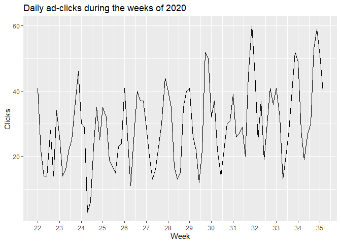
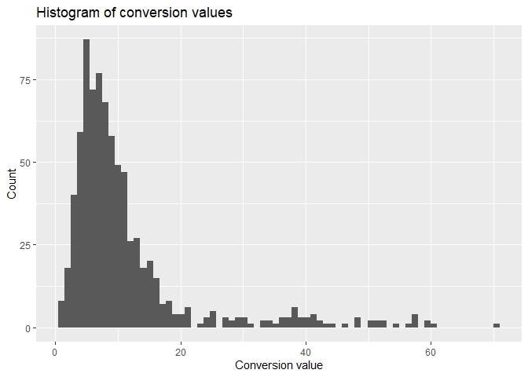
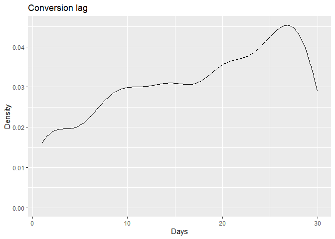
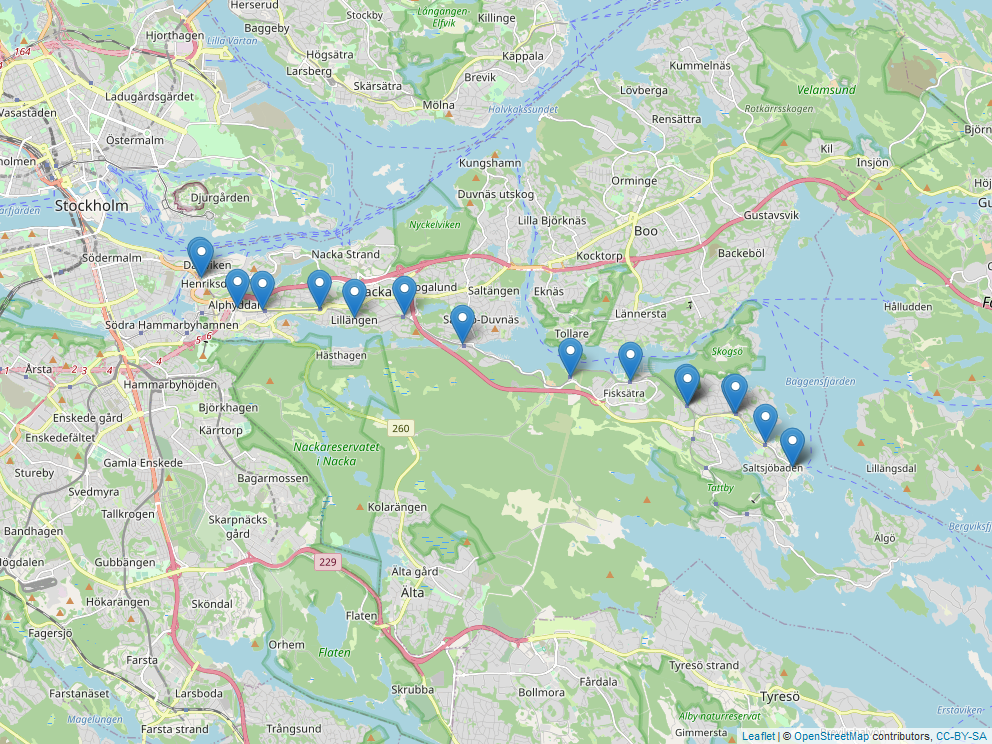

Homework 3
================
August Jonasson
2022-11-28

## Exercise 1: Marketing, conversions and conversion lags

``` r
# Connecting to SQLite db and then saving the two tables as data frames
con <- dbConnect(RSQLite::SQLite(), "../hw_data/seo_marketing_data.sqlite")
df_clicks <- tibble(dbReadTable(con, "Clicks"))
df_conversions <- tibble(dbReadTable(con, "Conversion_value"))
```

#### task a

Visualizing the number of clicks per day for mid 2020. Replacing
NA-values with zero.

``` r
# daily summaries of ad clicks
df_clicks_daily <- df_clicks %>%
  mutate(date = as.POSIXct(date)) %>%
  replace_na(list(adgroup = 0L)) %>%
  group_by(date) %>%
  summarize(clicks = n())

# plotting daily ad clicks as line diagram
df_clicks_daily %>%
  ggplot(aes(date, clicks)) +
  geom_line() +
  scale_x_datetime(date_breaks = "1 week", date_labels = "%W") +
  xlab("Week") +
  ylab("Clicks") +
  ggtitle("Daily ad-clicks during the weeks of 2020")
```

<!-- -->

#### task b

Given that there is a cost to each click, we want to find out which day
of the week has been the most costly.

``` r
# creating an ordered table of most costly weekdays, using lubridate::wday
df_clicks_daily %>%
  mutate(weekday = wday(date, label = TRUE, abbr = FALSE)) %>%
  group_by(weekday) %>%
  summarize(clicks = sum(clicks)) %>%
  arrange(desc(clicks)) %>%
  knitr::kable(caption = "Table 1: Weekday clicks", "simple")
```

| weekday | clicks |
|:--------|-------:|
| måndag  |    540 |
| söndag  |    538 |
| lördag  |    470 |
| tisdag  |    392 |
| fredag  |    321 |
| torsdag |    234 |
| onsdag  |    233 |

Table 1: Weekday clicks

From Table 1 we can tell that, assuming there is a cost to each click,
Monday is the most costly day of the week, with Sunday as a close
second.

#### task c

Plotting a histogram of the conversion values.

``` r
# df_conversions value as histogram
df_conversions %>%
  mutate(date = as.POSIXct(date)) %>%
  ggplot(aes(value)) +
  geom_histogram(bins = 70) +
  xlab("Conversion value") +
  ylab("Count") +
  ggtitle("Histogram of conversion values")
```

<!-- -->

#### task d

Joining the two data frames in order to calculate the conversion lags
(CL). Since we are only interested in the actual conversions, we can
ignore the clicks that didn’t lead to a conversion. We use an inner join
to achieve this.

``` r
# joining the clicks and conversions on customer id and then calculating CL
df_CL <- df_clicks %>%
  inner_join(df_conversions, by = "id",
             suffix = c("_click", "_conversion")) %>%
  mutate(CL_days = as.integer(difftime(ymd(date_conversion),ymd(date_click),
                                       "days")),
         date_click = as.POSIXct(date_click),
         date_conversion = as.POSIXct(date_conversion))
```

``` r
# plotting the CL distribution
df_CL %>%
  ggplot(aes(CL_days)) +
  geom_density() +
  xlab("Days") +
  ylab("Density") +
  ggtitle("Conversion lag")
```

<!-- -->

From the “Conversion lag” plot we can tell that the conversion lag
density is increasing from day 1 to around day 27, where it reaches its
peak, and then drops. In order to guess what this indicates, we decide
to look a bit more at the clicks data. We suspect the density has
something to do with the fact that salaries are paid the same time each
month. Lets try and get an overview of how clicks are distributed over
the day of the month.

``` r
# checking what days of the month that have the most clicks
df_clicks %>%
  mutate(date = as.POSIXct(date)) %>%
  mutate(day_of_month = lubridate::day(date)) %>%
  group_by(day_of_month) %>%
  summarize(clicks = n()) %>%
  arrange(desc(clicks)) %>%
  head(5) %>%
  knitr::kable("simple", caption = "Table 2: Clicks, day of the month")
```

| day_of_month | clicks |
|-------------:|-------:|
|            1 |    122 |
|           29 |    116 |
|           14 |    111 |
|           12 |    106 |
|           30 |     99 |

Table 2: Clicks, day of the month

From Table 2 we can tell that the most common time to click ads are at
the beginning, in the middle, and at the end of the month. The peak of
the density plot being at around 27 days might thereby correspond to the
people who click ads at the beginning and at the end of the month. They
then wait 25 to 30 days for their salaries to get paid before they
actually make the purchase. Since we also have a kind of a peak at
around 10 to 17 days in the conversion lag, this might correspond to the
people that look at ads mid-month and then make purchases when they
receive their salaries towards the end of the month.

It should be said that it is a bit weird that there are no conversions
that occur more than 30 days since the ad was clicked. We have to assume
that the ads only track the potential customer for 30 days and then drop
them, or maybe the timer is reset at the first of each month. We can’t
know for sure but it looks as if something is going on there.

#### task e

Transforming the data into the required table displaying the sum of
clicks for the days with specific conversion lags. Only the clicks that
actually lead to conversions are counted here.

``` r
# filtering, mutating, pivoting to get the required data
df_CL %>%
  filter(CL_days %in% c(25, 26, 27)) %>%
  group_by(date_click, CL_days) %>%
  summarize(n = n()) %>%
  arrange(CL_days) %>%
  mutate(CL_days = paste(as.character(CL_days), "days")) %>%
  pivot_wider(names_from = CL_days,
              values_from = n,
              names_prefix = "CL - ",
              values_fill = 0) %>%
  arrange(date_click) %>%
  tail(5) %>%
  knitr::kable("simple", caption = "Table 3: click sums")
```

| date_click | CL - 25 days | CL - 26 days | CL - 27 days |
|:-----------|-------------:|-------------:|-------------:|
| 2020-08-25 |            1 |            0 |            2 |
| 2020-08-26 |            0 |            1 |            0 |
| 2020-08-27 |            1 |            0 |            3 |
| 2020-08-28 |            0 |            0 |            1 |
| 2020-08-29 |            0 |            1 |            1 |

Table 3: click sums

And the mean conversion value using the same framework.

``` r
# filtering, mutating, pivoting to get the required data
df_CL %>%
  filter(CL_days %in% c(25, 26, 27)) %>%
  group_by(date_click, CL_days) %>%
  summarize(mvalue = mean(value)) %>%
  arrange(CL_days) %>%
  mutate(CL_days = paste(as.character(CL_days), "days")) %>%
  pivot_wider(names_from = CL_days,
              values_from = mvalue,
              names_prefix = "CL - ",
              values_fill = 0) %>%
  arrange(date_click) %>%
  tail(5) %>%
  knitr::kable("simple", caption = "Table 4: Mean conversion values")
```

| date_click | CL - 25 days | CL - 26 days | CL - 27 days |
|:-----------|-------------:|-------------:|-------------:|
| 2020-08-25 |     6.739229 |     0.000000 |    10.928268 |
| 2020-08-26 |     0.000000 |     5.622180 |     0.000000 |
| 2020-08-27 |     7.157074 |     0.000000 |    15.994510 |
| 2020-08-28 |     0.000000 |     0.000000 |     5.689383 |
| 2020-08-29 |     0.000000 |     6.652542 |    11.286285 |

Table 4: Mean conversion values

## Exercise 2: SL lines

Connecting to the SL sqlite database.

``` r
con2 <- dbConnect(RSQLite::SQLite(), "../hw_data/sl-api.sqlite")

# reading all of the tables in as data frames for ease of use
journeyPatterns <- dbReadTable(con2, "journeyPatterns")
lines <- dbReadTable(con2, "lines")
sites <- dbReadTable(con2, "sites")
stopAreas <- dbReadTable(con2, "stopAreas")
stopPoints <- dbReadTable(con2, "stopPoints")
transportmodes <- dbReadTable(con2, "transportmodes")
```

#### task a

The available tables:

| Tables          |
|:----------------|
| journeyPatterns |
| lines           |
| sites           |
| stopAreas       |
| stopPoints      |
| transportmodes  |

Table 5: Tables in SL api

A ‘site’ is a grouping of stop areas, which is a grouping of stop
points, which are the actual stops along the route of a line. A line is
the identifier the customer uses to identify a specific combination of
transportation route and transportation mode. Transportation mode is the
kind of transportation (e.g. bus , tram ..). Journey pattern is the
unique route taken by a specific line.

Sites are used to make searching in the travel planner easier. Stop
areas are geographical groupings of stop points and transportation modes
( e.g. a terminal), and are uniquely identified by a stop area number.
Stop points are in turn uniquely identified by their stop point number.
An observation contains both a stop point number and a stop area number.
The stop point number is completely unique in the data frame whilst the
stop area number can occur more than once.

These are the semantics of the data frames collected from the API.
However, some of this information is duplicated across the different
tables. Because of this reason it is easier to only stick to the
semantics, while explaining how the variables/tables are related to one
another.

#### task b

Since we have already loaded all of the data into r, all that remains is
to convert the variables that weren’t correctly parsed into their
correct data types. We reload them, but change the data types
simultaneously.

``` r
sites <- dbReadTable(con2, "sites") %>%
  mutate(SiteId = as.integer(SiteId),
         StopAreaNumber = as.integer(StopAreaNumber))

journeyPatterns <- dbReadTable(con2, "journeyPatterns") %>%
  mutate(JourneyPatternPointNumber = as.integer(JourneyPatternPointNumber))

stopAreas <- dbReadTable(con2, "stopAreas") %>%
  mutate(StopPointNumber = as.integer(StopPointNumber),
         StopAreaNumber = as.integer(StopAreaNumber))

stopPoints <- dbReadTable(con2, "stopPoints") %>%
  mutate(StopPointNumber = as.integer(StopPointNumber),
         StopAreaNumber = as.integer(StopAreaNumber))
```

#### task c

To make a table listing the number of active unique railway stops in
each zone we have to first check which stop point numbers exist in the
journey pattern. If they exist, the stops are active. We define unique
as having a unique stop point number.

``` r
# using semi join to only keep the stops that appear in journey patterns
stopPoints %>%
  filter(StopAreaTypeCode %in% c("METROSTN", "RAILWSTN", "TRAMSTN")) %>%
  semi_join(journeyPatterns,
            by = c("StopPointNumber" = "JourneyPatternPointNumber")) %>%
  count(ZoneShortName, sort = TRUE) %>%
  knitr::kable(col.names = c("zone", "n_stations"),
               "simple",
               caption = "Table 6: Active railway stations in each zone.")
```

| zone | n_stations |
|:-----|-----------:|
| A    |        410 |
| B    |        120 |
| C    |         32 |
|      |          3 |

Table 6: Active railway stations in each zone.

Table 6 displays the number of unique railway stations in each zone, and
the number of stations that were not declared as being part of any zone.

#### task d

Choosing line 25 as the line to plot.

``` r
# creating dataframe containing only stop names and coordinates
line25 <- journeyPatterns %>%
  filter(LineNumber == 25, DirectionCode == 1) %>%
  inner_join(stopPoints,
             by = c("JourneyPatternPointNumber" = "StopPointNumber")) %>%
  mutate(lat = as.numeric(LocationNorthingCoordinate),
         lon = as.numeric(LocationEastingCoordinate)) %>%
  select(StopPointName, lon, lat)
```

Creating the map plot using leaflet, and then using mapview in order to
display map as png.

``` r
# using leaflet map to plot stops
m <- leaflet(line25) %>%
  addTiles() %>%
  addMarkers(lng = ~lon, lat = ~lat, popup = ~StopPointName)

# using mapview::mapshot in order to display in .md format
mapshot(m, file = "HW3_files/figure-gfm/line25.png")

```

<!-- -->

From the map we can see all stops belonging to line 25 (Saltsjöbanan).

#### task e

Since the stopAreas and stopPoints tables are identical as is, we could
just remove pretty much everything, except for the identifying numbers,
from stopAreas. This will greatly reduce its size.

``` r
stopAreas_sparse <- stopAreas %>%
  select(StopPointNumber, StopAreaNumber)

# new table size as part of old table size
as.integer(object.size(stopAreas_sparse)) / as.integer(object.size(stopAreas))
```

    ## [1] 0.03110707

As we can see, the new table size is around 3 % of the original table
size. In order to obtain the old stopAreas table, all we would have to
do is perform an inner join with the stopPoints table. It would also be
wise to remove the stop area number from the stopPoint table in order to
reduce table sizes even further, but since this assignment only asks to
improve on the stopAreas table, we will not make those improvements.
However, unless we also remove the stop area number from the stopPoint
table, we will get duplicates of that variable when we perform the inner
join.

It is rather weird that the two tables are identical. In theory, we
should try to keep as few things duplicated as possible. We only need
one column in either table to match one column in the other for a join
to be possible. This would be a lot more memory efficient.
