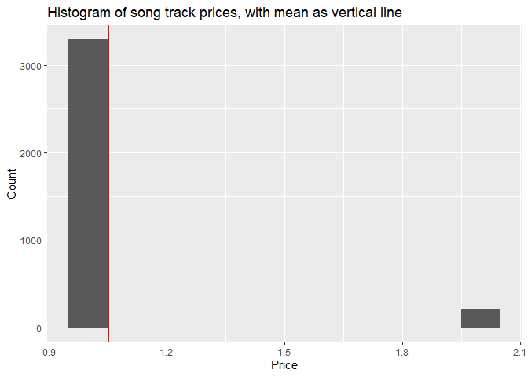
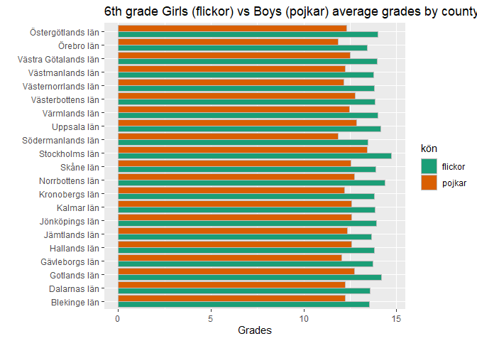
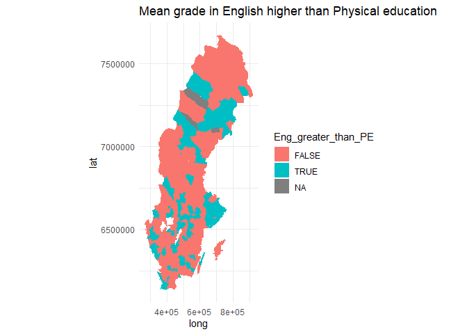

Homework 4
================
August Jonasson
2022-12-05

## Exercise 1: SQL, SQl, Sql, sql!

#### task a

``` r
con = dbConnect(RSQLite::SQLite(), "../hw_data/chinook.db")
```

#### task a

Extracting all data from the tracks table, calculating the mean unit
price using a SQL query, and then plotting as histogram with vertical
line representing the mean unit price.

``` r
tracks <- dbReadTable(con, "tracks")
mean_unit_price <- dbGetQuery(con, "SELECT AVG(UnitPrice) AS m
                                    FROM tracks;")

ggplot(tracks, aes(x=UnitPrice)) +
  geom_histogram(binwidth = 0.1) +
  geom_vline(xintercept = pull(mean_unit_price, m), color = "Red") +
  ggtitle("Histogram of song track prices, with mean as vertical line") +
  xlab("Price") +
  ylab("Count")
```

<!-- -->

There seem to be only two distinct song prices, with the cheaper one
being the very dominant. As a result of this, the mean is very close to
the mode of the unit prices, therefor, the median, or mode, might be a
bit more representative of the unit prices.

#### task b

``` r
dbGetQuery(con,"SELECT genres.Name AS Genre, COUNT(tracks.GenreID) AS n_tracks
                FROM tracks
                INNER JOIN genres ON tracks.GenreId = genres.GenreId
                GROUP BY tracks.GenreId
                ORDER BY n_tracks
                LIMIT 3;")
```

    ##             Genre n_tracks
    ## 1           Opera        1
    ## 2   Rock And Roll       12
    ## 3 Science Fiction       13

From this query we can tell that Opera has the least amount of tracks -
with only one track.

#### task c

We decide to interpret the task as “Which song has the most amount of
tracks in a **single** playlist?”.

``` r
# we decide to use LEFT JOIN just to make sure that no information is lost
dbGetQuery(con, "SELECT genres.Name AS genre,
                        playlists.Name AS playlist_name,
                        playlist_track.PlaylistId AS playlist_id,
                        COUNT(playlist_track.PlaylistId) AS n_tracks
                 FROM playlist_track
                 LEFT JOIN playlists ON playlist_track.PlaylistId = playlists.PlaylistId
                 LEFT JOIN tracks ON playlist_track.TrackId = tracks.TrackId
                 LEFT JOIN genres ON tracks.GenreId = genres.GenreId
                 GROUP BY playlist_track.PlaylistId, genres.GenreId
                 ORDER BY n_tracks DESC
                 LIMIT 3;")
```

    ##   genre playlist_name playlist_id n_tracks
    ## 1  Rock         Music           1     1297
    ## 2  Rock         Music           8     1297
    ## 3  Rock    90’s Music           5      621

As we can tell from this query, Rock is the genre that has the most
songs in a single playlist. It even occupies all top three spots. It is
a bit unclear if the playlists called Music refer to the same or
different playlists. Their playlist IDs are different, but their names
the same. We assume they are different playlists that should not be
grouped together (since they have the same number of rock songs, they
might however be identical).

#### task e

In order to get the composer with the most tracks in a playlist, and the
name of that playlist, we use a very similar query as for the previous
task.

``` r
dbGetQuery(con,
           "SELECT tracks.Composer AS composer,
                   playlists.Name AS playlist_name,
                   playlist_track.PlaylistID AS playlist_id,
                   COUNT(playlist_track.PlaylistID) AS n_tracks
            FROM playlist_track
            LEFT JOIN playlists ON playlist_track.PlaylistId = playlists.PlaylistId
            LEFT JOIN tracks ON playlist_track.TrackId = tracks.TrackId
            WHERE tracks.Composer IS NOT NULL
            GROUP BY playlist_track.PlaylistId, tracks.Composer
            ORDER BY n_tracks DESC
            LIMIT 3;")
```

    ##       composer playlist_name playlist_id n_tracks
    ## 1 Steve Harris         Music           1       80
    ## 2 Steve Harris         Music           8       80
    ## 3           U2         Music           1       44

``` r
# and now we can disconnect
dbDisconnect(con)
```

From the query above we can see that Steve Harris is the composer with
the most songs in a single playlist. He has 80 songs in two different
playlists (that might be identical to each other), and they are both
called Music.

## Exercise 2: Skolverkets information about 6th graders

### Definition of non-numeric values

    "."     : if data is missing
    ".."    : if result is based on less than 10 students (secrecy reasons)
    "~100"  : if only 1-4 students did not pass (if either boys or girls are
              with this, the other sex is declared as "..")

### Handling of non-numeric values

Since “**.**” represents missing values, there isn’t much else to do
than just remove them from the data. We wouldn’t be able to really say
anything meaningful about the rows that contain them.

The “**\~100**” value only appears in the “Andel\*” variables. These
don’t seem to be of importance for the tasks we are given. We can
therefor ignore these for now and just try to make sure we work around
them.

The “**..**” value, however, also appears in the “Antal\*” columns, and
these are columns we will need to calculate our weighted averages. The
only real option we have here is to simply remove all rows that contain
two dots in either of the number of students by sex variables. If we
don’t do this, we wont be able to calculate our means, and if we make
estimates, we risk being very wrong. Removing these corresponds to cirka
20 % of the data frame rows, which is quite a bit of data. Hopefully
this doesn’t contaminate the data too much, since the two dots at the
very least represented municipalities where less than 10 students were
used for the result. At least their weights would be relatively small.

We also have to remove the rows with two dots in the “Genomsnittlig
betygspoäng” variables since these are variables we need for the
upcoming tasks. These aren’t as many, and brings up our total dropped
percentage of rows to around 21 %.

``` r
# using name_repair to avoid forcing of unique variable names
sixth_graders_grades <- read_csv2("../hw_data/exp_betyg_ak6_kommun_2018_19.csv",
                      skip = 4,
                      name_repair = "minimal")

# now pasting first row into variable names, and trimming white spaces
colnames(sixth_graders_grades) <- paste(names(sixth_graders_grades), sixth_graders_grades[1,]) %>% trimws()

# tidying the data
sixth_graders_grades <- sixth_graders_grades %>%
  
  # removing the first row
  slice(-1) %>%
  
  # restricting the data to what is relevant for task
  filter(`Typ av huvudman` == "Samtliga") %>%
  
  # removing spaces from columns to be parsed as numeric, also commas into dots
  mutate(across(c(`Antal elever Totalt`,
                  `Antal elever Pojkar`,
                  `Antal elever Flickor`,
                  `Genomsnittlig betygspoäng Totalt`,
                  `Genomsnittlig betygspoäng Pojkar`,
                  `Genomsnittlig betygspoäng Flickor`),
                  ~ str_replace_all(.x, c(" " = "", "," = "\\.")))) %>%
  
  # converting to numeric, thereby making "." and ".." into NA
  mutate(`Antal elever Totalt` = as.integer(`Antal elever Totalt`),
         `Antal elever Pojkar` = as.integer(`Antal elever Pojkar`),
         `Antal elever Flickor` = as.integer(`Antal elever Flickor`),
         `Genomsnittlig betygspoäng Totalt` = as.numeric(`Genomsnittlig betygspoäng Totalt`),
         `Genomsnittlig betygspoäng Pojkar` = as.numeric(`Genomsnittlig betygspoäng Pojkar`),
         `Genomsnittlig betygspoäng Flickor` = as.numeric(`Genomsnittlig betygspoäng Flickor`)) %>%
  
  # dropping na values, ca 21 % of the rows 
  drop_na(c(`Antal elever Totalt`,
            `Antal elever Pojkar`,
            `Antal elever Flickor`,
            `Genomsnittlig betygspoäng Totalt`,
            `Genomsnittlig betygspoäng Pojkar`,
            `Genomsnittlig betygspoäng Flickor`))
```

#### task a

We first have to create a weight for each sex for county and subject. We
create this as a data frame and then join it to our original data frame.
We then create the weights by dividing the number of students of one
municipality and subject by the total number of students in that county,
for that subject. This gives us weighted grades for each subject, for
each county. We can finally calculate the mean grade for that county by
also weighing the subjects by the total number of students per subject
in county.

``` r
# first weighted by county and subject
grades_municipality <- sixth_graders_grades %>%
  
  # count number of boys and girls in each municipality
  group_by(Kommun) %>%
  summarize(n_pojkar_kommun = sum(`Antal elever Pojkar`),
            n_flickor_kommun = sum(`Antal elever Flickor`)) %>%
  
  # join this data to original df in order to create subject weights
  right_join(sixth_graders_grades, by = "Kommun") %>%
  
  # andel = weight
  mutate(andel_kommun_pojkar = `Antal elever Pojkar` / n_pojkar_kommun,
         andel_kommun_flickor = `Antal elever Flickor` / n_flickor_kommun) %>%
  
  # now we can group with the weights included
  group_by(Län, Kommun) %>%
  
  # and calculate the weighted mean for each municipality 
  summarize(kommun_medel_pojkar = sum(andel_kommun_pojkar * `Genomsnittlig betygspoäng Pojkar`),
            kommun_medel_flickor = sum(andel_kommun_flickor * `Genomsnittlig betygspoäng Flickor`),
            antal_pojkar_kommun = sum(`Antal elever Pojkar`),
            antal_flickor_kommun = sum(`Antal elever Flickor`))
  
# in order to calculate mean for county we have to create municipality weights
grades_county <- grades_municipality %>%
  
  # repeat same process as when weighing per subject
  group_by(Län) %>%
  summarize(antal_pojkar_län = sum(antal_pojkar_kommun),
            antal_flickor_län = sum(antal_flickor_kommun)) %>%
  right_join(grades_municipality, by = "Län") %>%
  mutate(andel_pojkar_län = antal_pojkar_kommun / antal_pojkar_län,
         andel_flickor_län = antal_flickor_kommun / antal_flickor_län) %>%
  group_by(Län) %>%
  
  # create weighted average grades for each county
  summarize(län_medel_pojkar = sum(andel_pojkar_län * kommun_medel_pojkar),
            län_medel_flickor = sum(andel_flickor_län * kommun_medel_flickor))
```

Finally, we can plot our result. We choose this plot because it is very
easy to understand and it gives a good sense of the whole spectrum of
grades and the actual scale of the difference between boys and girls.

``` r
grades_county %>%
  pivot_longer(c("län_medel_pojkar", "län_medel_flickor"),
               names_to = "kön",
               values_to = "län_medel") %>%
  mutate(kön = str_replace(kön, "län_medel_", "")) %>%
  ggplot(aes(x = Län, y = län_medel, fill = kön)) +
  geom_bar(stat = "identity", position = "dodge", color = "grey") +
  xlab("") +
  ylab("Grades") +
  coord_flip() +
  scale_fill_brewer(palette = "Dark2") +
  ggtitle("6th grade Girls (flickor) vs Boys (pojkar) average grades by county")
```

<!-- -->

#### task b

First lets filter out the data that we need and transform it to tidy
format.

``` r
# checking if english grade > P.E. grade
english_pe <- sixth_graders_grades %>%
  filter(Ämne %in% c("Engelska", "Idrott och hälsa")) %>%
  select(Kommun, `Kommun-kod`, Ämne, `Genomsnittlig betygspoäng Totalt`) %>%
  pivot_wider(names_from = Ämne,
              values_from = `Genomsnittlig betygspoäng Totalt`) %>%
  mutate(Eng_greater_than_PE = Engelska > `Idrott och hälsa`)
```

Now lets plot the Swedish map using this. Coloring is done by
municipality and whether or not average English grade is higher than
physical education.

``` r
# joining kommun_karta to english_pe by id = kommun-kod
kommun_karta <- read_csv("../hw_data/kommun_karta.csv") %>%
  left_join(english_pe, by = c("id" = "Kommun-kod"))

# plotting with fill equal to logical column defined in english_pe df
ggplot(kommun_karta, aes(x = long, y = lat, group = group,
                         fill = Eng_greater_than_PE)) +
  geom_polygon() +
  coord_fixed() +
  theme_minimal() +
  ggtitle("Mean grade in English higher than Physical education")
```

<!-- -->

#### task c

From the map plot we draw the conclusion that students seem to be better
at English than physical education in the big cities (e.g. Stockholm,
Gothenburg, Malmö) while the opposite relationship holds for most of the
countryside. It seems reasonable that the big cities are better at
English since they attract more foreign people than the countryside. The
opposite relationship might be that the countryside is bad at English
since they don’t get to practice it as much. There could however be a a
lot of “hidden” contributing factors, such as the best English teachers
are attracted to the big citites since they love communicating so much,
while the best P.E. teachers are attracted to the countryside because
they want the extra space. One could speculate about a lot of different
things.

#### task d

For the final task, we use the same process for creating weights as
earlier, but we can now weigh the subjects in the entire country
directly in order to get the mean grade per subject.

``` r
subjects_sweden <- sixth_graders_grades %>%
  group_by(Ämne) %>%
  mutate(antal_elever_ämne = sum(`Antal elever Totalt`)) %>%
  summarize(betyg_ämne = sum(`Antal elever Totalt` * `Genomsnittlig betygspoäng Totalt`/ antal_elever_ämne)) %>%
  arrange(desc(betyg_ämne))

knitr::kable(head(subjects_sweden, 10), "pipe",
             caption = "Table 1: Mean grades per subject in Sweden")
```

| Ämne                          | betyg_ämne |
|:------------------------------|-----------:|
| Modersmål                     |   14.32088 |
| Engelska                      |   14.11407 |
| Moderna språk som språkval    |   14.00970 |
| Teckenspråk                   |   14.00000 |
| Musik                         |   13.99291 |
| Moderna språk som elevens val |   13.82689 |
| Bild                          |   13.82367 |
| Idrott och hälsa              |   13.81524 |
| Hem- och konsumentkunskap     |   13.80823 |
| Slöjd                         |   13.59922 |

Table 1: Mean grades per subject in Sweden

Looking at Table 1, we can see that Sweden has a higher grade in English
than they do in physical education. This goes well with our previous
conclusion since the big cities hold most of the population.
