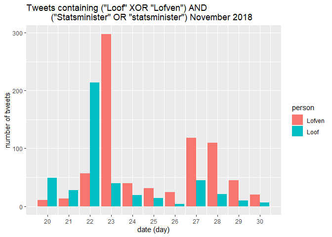

Homework 5
================
August Jonasson
2022-12-12

## Exercise 1: Lööf vs Löfven

#### task a

We combine two joins and rbind in order to get an “outer join” - a join
that ignores the intersection between the Loof and Lofven data frames.

``` r
# laoding the data
load("../hw_data/LoofLofvenTweets.Rdata")

# adding 'person' variable to each data frame
Loof <- Loof %>% mutate(person = "Loof")
Lofven <- Lofven %>% mutate(person = "Lofven")

# temp df for storing all tweets that mention both Loof and Lofven
duplicates <- Lofven %>%
  semi_join(Loof, by = "status_id")

# full tweets df ignoring tweets where both Loof and Lofven were mentioned
tweets <- Loof %>%
  rbind(Lofven) %>%
  anti_join(duplicates, by = "status_id")

# removing the temp df
rm(duplicates)

# maybe this makes it easier to grade? number of rows in tweets:
nrow(tweets)
```

    ## [1] 9344

#### task b

Visualizing the number of tweets containing the word “statsminister” in
combination with either “Loof” or “Lofven” during November 2018.

``` r
# pattern to look for, using the rebus package
pattern <- or("S", "s") %R% "tatsminister"

# using str_detect in combo with group_by and summarize to get daily mentions
tweets %>%
  mutate(contains_statsminister = str_detect(text, pattern),
         created_at = lubridate::date(created_at)) %>%
  group_by(created_at, person) %>%
  summarize(n_tweets = sum(contains_statsminister)) %>%
  ggplot(aes(x = created_at, y = n_tweets, fill = person)) +
  geom_bar(stat = "identity", position = "dodge") +
  scale_x_date(breaks = "1 day", date_labels = "%d") +
  ggtitle('Tweets containing ("Loof" XOR "Lofven") AND
          ("Statsminister" OR "statsminister") November 2018') +
  xlab("date (day)") +
  ylab("number of tweets")
```

<!-- -->

#### task c

In this task we want to estimate the daily sentiment of the tweets
associated with each politician. In order to do this we first want to
split each tweet into the words it consists of, group and count the
words while keeping the association to said politician, and finally give
the politician a daily score based on the average sentiment of each
word.

For the actual scoring of the words, we use a sentiment lexicon funded
by the Swedish Academy. Negative scores represent negative sentiments,
while positive scores represent positive sentiments (range is -3 to +3).
We use the ‘confidence’ variabale in order to weigh the reliability of
the sentiment score.

``` r
url_sentiment_lex <- 'https://svn.spraakdata.gu.se/sb-arkiv/pub/lmf/sentimentlex/sentimentlex.csv'
df_sentiment_lex <- read_csv(url_sentiment_lex) %>%
  select(word, strength, confidence) # we don't need the rest
```

We can now proceed to transform the data into above mentioned format.

``` r
# we'll need this function in the next chunk to clean up words
remove_nonletters_from_lowercase_words <- function(string) {
  pattern = negated_char_class("abcdefghijklmnopqrstuvwxyzåäö")
  str_replace_all(string, pattern, "")
}
```

``` r
df_daily_sentiment <- tweets %>%
  
  # removing time stamp from date variable and selecting relevant variables
  mutate(created_at = lubridate::date(created_at)) %>%
  select(created_at, text, person) %>%
  
  # separating the tweets into words, making letters lowercase, and removing non-letters
  separate_rows(text, sep = or(SPC, "-")) %>%
  mutate(text = tolower(text),
         text = remove_nonletters_from_lowercase_words(text)) %>%
  
  # joining with the sentiment lexicon in order to get word scores
  inner_join(df_sentiment_lex, by = c("text" = "word")) %>%
  
  # calculating the daily sentiments for each politician
  group_by(created_at, person) %>%
  summarize(sentiment = mean(strength * confidence))
```

It should be notet that we have not considered the words that did not
have a match in the sentiments lexicon. From the information provided,
we could not come up with a sensible way to account for these in our
estimation.

``` r
ggplot(df_daily_sentiment, aes(x = created_at, y = sentiment, fill = person)) +
  geom_bar(stat = "identity", position = "dodge") +
  scale_x_date(breaks = "1 day", date_labels = "%d") +
  xlab("Date (day)") +
  ylab("Sentiment score") +
  ggtitle("Daily sentiment estimations")
```

<!-- -->

It is very hard to give actual meaning to the scores from the “Daily
sentiment estimation” plot. This plot might best be served only as a
comparison between said politician sentiments.

## Exercise 2: Nobel API v2

#### task a and b

We decide to fetch the nobel prize in literature data from year 1990 to
2009. Using jsonlite and dplyr unnest_wider in order to retrieve the
motivations, and their words.

``` r
nobel_url <- "https://api.nobelprize.org/2.1/nobelPrizes?nobelPrizeYear=1990&yearTo=2009&nobelPrizeCategory=lit&format=json"
nobel_motiv_words <- fromJSON(nobel_url, flatten = TRUE)$nobelPrizes %>%
  select(laureates) %>%
  unnest_wider(laureates) %>%
  select(motivation.en) %>%
  separate_rows(motivation.en, sep = SPC)
```

Joining with the stop words and cleaning up what remains.

``` r
stop_words_url <- "https://raw.githubusercontent.com/stopwords-iso/stopwords-en/master/stopwords-en.txt"
stopwords <- read_table(stop_words_url, col_names = "words")

nobel_motiv_words_clean <- nobel_motiv_words %>%
  transmute(words = remove_nonletters_from_lowercase_words(motivation.en)) %>%
  na_if("") %>%
  drop_na() %>%
  anti_join(stopwords, by = "words") %>%
  count(words)
```

And finally plotting the result as a wordcloud, where frequency is
represented by word size.

``` r
set.seed(123)
ggplot(nobel_motiv_words_clean, aes(label = words, size = n)) +
  geom_text_wordcloud()
```

<!-- -->
