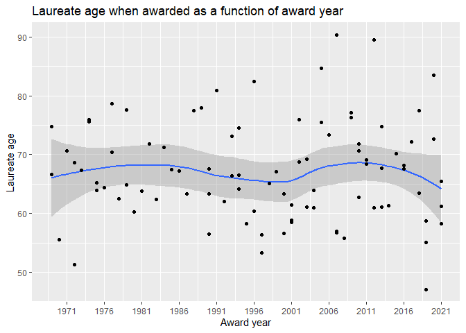

Homework 6
================
August Jonasson
2022-12-20

## Exercise 1

#### task a

First step is to gather a list with all of the laureate IDs that we
need. We will then use these IDs in combination with different endpoints
in order to gather all the data that we need in this exercise. Using
map_df to create the final data frame.

It should be mentioned that there are easier ways to do this, e.g. using
unnest directly on the data received from the api call, since it is
already a data frame. Since the question specifically asked for the
purrr package, and its map functions (that should mainly be used for
lists, not data frames), this is the way we managed to implement what
was asked for.

``` r
# url to fetch all the laureates info for the economy prize from 1969 - 2021
nobel_url <- 'https://api.nobelprize.org/2.1/laureates?limit=100&nobelPrizeYear=1969&yearTo=2021&nobelPrizeCategory=eco&format=json'

# extracting the IDs for all the laureates as a list
id_list <- fromJSON(nobel_url, flatten = TRUE)$laureates %>%
  pull(id) %>%
  as.list()

# map_df returns a data frame and each iteration returns a row
laureates <- map_df(id_list, function(x){
  
      # getting the laureates info through the laureates endpoint
      laureate_url <- str_c("http://api.nobelprize.org/2.1/laureates?ID=", x)
      fromJSON(laureate_url, flatten = TRUE)$laureate %>%
      
      # unnesting nobelPrizes to get award year and category
      unnest(nobelPrizes, names_repair = "minimal")}) %>%  # end of map
      
  # selecting relevant variables
  select(id, awardYear, givenName.en, familyName.en, category.en) %>%
  
  # renaming to desired names
  rename(year = awardYear, firstName = givenName.en,
         lastName = familyName.en,category = category.en)

knitr::kable(head(laureates, 3))
```

| id  | year | firstName  | lastName | category          |
|:----|:-----|:-----------|:---------|:------------------|
| 745 | 2001 | A. Michael | Spence   | Economic Sciences |
| 982 | 2019 | Abhijit    | Banerjee | Economic Sciences |
| 882 | 2012 | Alvin E.   | Roth     | Economic Sciences |

``` r
writeLines(paste(as.character(nrow(laureates)), "laureates in total"))
```

    ## 89 laureates in total

#### task b

Using the same method as in the previous task but now calling a
different endpoint for the information - in order to add gender and day
of birth for the laureates. Also calculating lauerate age when awarded.

``` r
laureates_info <- map_df(id_list, function(x) {
  
    # getting the laureates info through the ID endpoint
    url <- str_c('http://api.nobelprize.org/2.1/laureate/', x)
    fromJSON(url, flatten = TRUE)}) %>% # end of map
  
  select(id, gender, birth.date) %>%
  
  inner_join(laureates, by = "id") %>%
  
  rename(day_of_birth = birth.date) %>%

  # some cleaning of date columns in order to calculate laureate age when awarded
  mutate(year = as.POSIXct(str_c(year, "-12-01")),
         # changing all 00-00 birthdays to middle of the year 06-01
         day_of_birth = as.POSIXct(ifelse(str_detect(day_of_birth, "00-00"),
                                          str_replace(day_of_birth, "00-00", "06-01"),
                                          day_of_birth)),
         age_when_awarded = lubridate::time_length(difftime(year, day_of_birth), "years"))

knitr::kable(head(laureates_info, 3))
```

| id  | gender | day_of_birth | year       | firstName  | lastName | category          | age_when_awarded |
|:----|:-------|:-------------|:-----------|:-----------|:---------|:------------------|-----------------:|
| 745 | male   | 1943-06-01   | 2001-12-01 | A. Michael | Spence   | Economic Sciences |         58.50251 |
| 982 | male   | 1961-02-21   | 2019-12-01 | Abhijit    | Banerjee | Economic Sciences |         58.77344 |
| 882 | male   | 1951-12-18   | 2012-12-01 | Alvin E.   | Roth     | Economic Sciences |         60.95551 |

#### task c

Now to calculate proportions of female vs male laureates.

``` r
laureates_info %>%
  count(gender) %>%
  pivot_wider(names_from = gender, values_from = n) %>%
  mutate(across(everything(), ~ format(.x * 100 / (female+male), digits = 4))) %>%
  knitr::kable(format = "pipe" , caption = "Percentage of laureates by gender")
```

| female | male  |
|:-------|:------|
| 2.247  | 97.75 |

Percentage of laureates by gender

#### task d

And for the plotting of how the age of the laureates has evolved over
time.

``` r
laureates_info %>%
  mutate(year = lubridate::floor_date(year, "year")) %>%
  ggplot(aes(x = year, y = age_when_awarded)) +
  geom_smooth(method = "loess") +
  geom_point() +
  scale_x_datetime(breaks = "5 years", date_labels = "%Y",) +
  labs(x = "Award year", y = "Laureate age") +
  ggtitle("Laureate age when awarded as a function of award year")
```

<!-- -->

As we can tell from the smooth line, overall, the age seems to have been
pretty stable since 1969, but if one were to disregard the years prior
to circa 1973 it becomes more obvious that the spread of the age has
increased, downwards and upwards. Both younger and older people are
slightly more frequently awarded as we go forward in time. However, this
is very sligtly, as one can tell from the margin of error on the smooth
line.

## Exercise 2

#### state a catchy title for the project

**to be announced**

#### short text about the story I want to tell with my project

I want to explore data related to music and combine it with other data
in order to tell a story about how the music preferences of a country
might reveal more than one would expect. For example, it would be
interesting to see if BPM (beats per minute) has some correlation to
average life expectancy, or maybe prevalence of heart-attacks in a
country. This is just an example but I expect to come up with more
things as I get further into the project. This might sound very serious,
but these are meant to be goofy, and Not taken too seriously, since this
project is about the technical aspects of the data, not the conclusions
that are drawn from it.

#### data source

my main source for this project will be the spotify api, and I will get
access to this using the R wrapper spotifyr. I have no idea how large or
what the scope of the data will be at this point. I am aiming to gather
songs from top lists by country, but I’m not sure how far back in time I
will be able to extract the data. I don’t have the data yet, but I have
an idea of how to retrieve it.

#### greatest element of uncertainty in terms of what is expected from me in this project

I have no idea how much work I am expected to put into this. Just
analyzing the time left until the project is due, I guess maybe 30-40
hours i reasonable, considering we have an exam to study for as well. I
do have the feeling that these hours won’t be enough though.

#### biggest technical challenge

I expect the biggest technical challenge to be learning how to work with
the spotify api in order to extract the information that I am interested
in.
